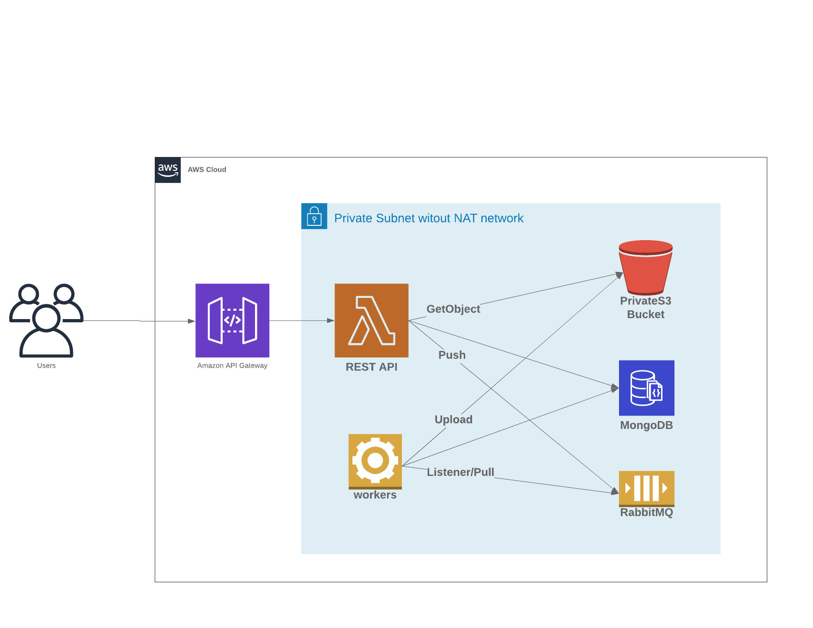

# Exports Assignment

Check the [assignment](ASSIGNMENT.md) and [local setup](SETUP.md).

## Architecture

## Design
### Reliability
Unfortunately the reliability of this system can only be as reliable as the data of its indirect dependents (system 
which produces `vehicle` databases). A simple solution as defining schemas for the collections would help.

In case of corrupted data there could be a new/existing component (in the producer system) which tries to correct data 
but this comes with the cost of bigger complexity and bigger maintainability.

Also, in case of failure (upload to S3 for example) the system uses the queue `nack` mechanism as failover.

### Availability
MongoDB: Replica Set topology is expected.

RabbitMQ: Cluster with queue mirroring.

In terms of recovery, depending on the framework used, some components may be brought to life automatically. Locally
this is emulated with `restart: always` on docker-compose.

### Maintainability
Not assured in this solution but it would pass by setting an alert system (and try to avoid human interaction), error 
handling, proper logging system, and try to use enterprise features to minimise the overall effort.

### Improvements
Something that would help this design is implementing the [Chaos Monkey](https://github.com/Netflix/chaosmonkey) in
production as it'd put some pressure on the system.

High testing coverage would give bigger reliability and maintainability (in long-term).
  
### REST API Access Permissions
* **Database**: User with "ReadWrite" role to `exports.jobs` collection;
* **S3**: User with `AmazonS3ReadOnlyAccess` policy (`GetObject` action);
* **RabbitMQ*** User with permission for `basic.publish` to a specified queue.

### Workers Access Permissions
* **Database**: User with "Read" role to `vehicle` databases and "ReadWrite" role to `exports.jobs` collection;
* **S3**: User with `PutObject` action in an attached S3 policy;
* **RabbitMQ** User with permission for `basic.consume` to a specified queue.